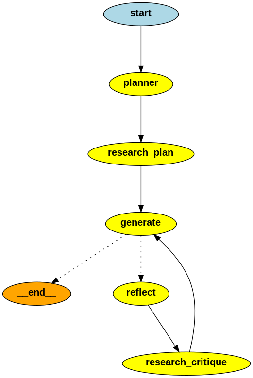

# Project Overview

This project leverages LangGraph, LangChain, and Tavily for internet search functionalities. It consists of:

1. **Agent Implementation**:
   - **Plan-Action Pattern**
   - **Creator-Critic Pattern**
2. **Additional Nodes**:
   - For finding relevant articles on the internet
3. **Gradio Interface**:
   - Launch specific nodes in the graph
   - Manually adjust LLM responses
   - Track graph state and navigate through time (time-travel magic)

### Source
Based on the course "AI Agents in LangGraph" from [DeepLearning.AI](https://learn.deeplearning.ai/courses/ai-agents-in-langgraph/lesson/1/introduction)

